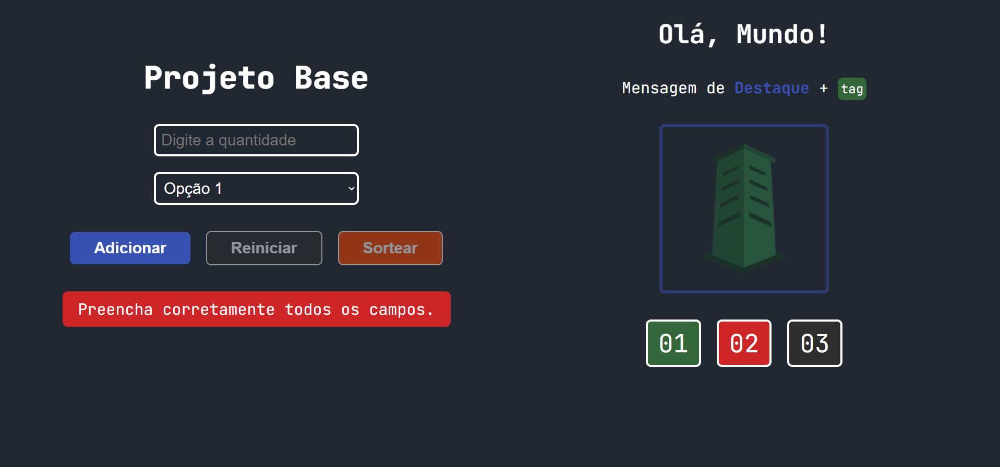
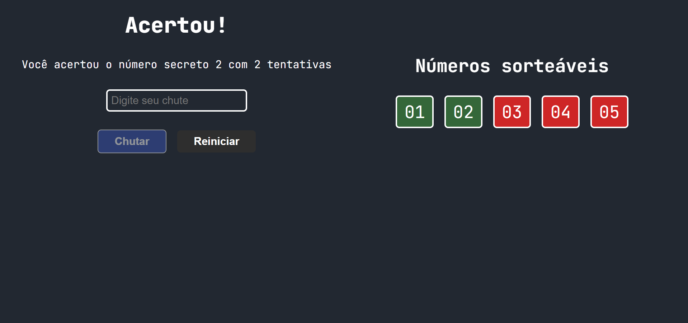
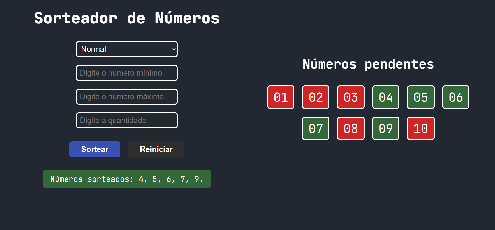
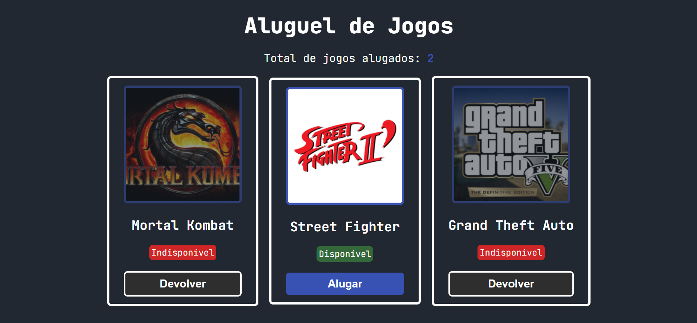
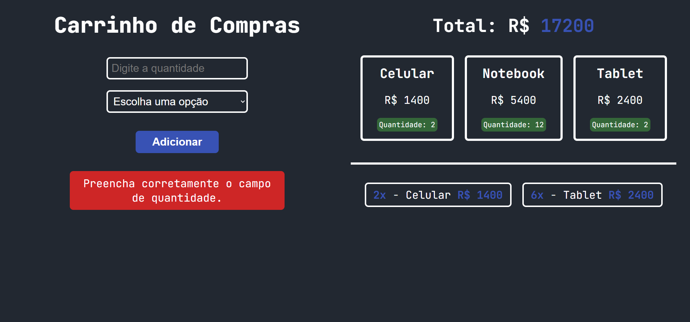
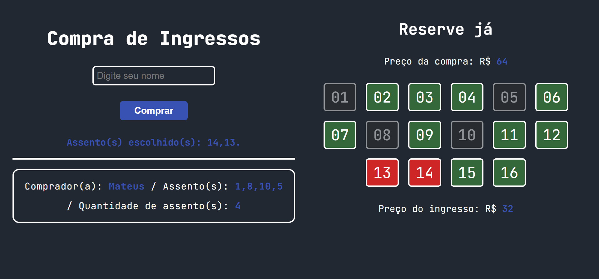
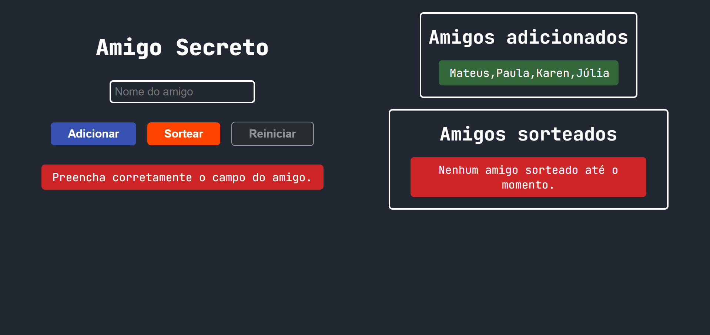

# LogicLab

## Layout

| VSCode | HTML5 | CSS3 | JavaScript |
|------|------| ---------- | ---------------- |
|  |  |  |  |

## About

### Base Project

It is an HTML5 and CSS3 project designed to avoid repeatedly creating structure and styling for every new project. Instead, it establishes a reusable template that can be applied across different projects, promoting the concept of reusability. It also introduces a more efficient workflow, reducing the need to write unnecessary HTML and CSS, and allowing greater focus on programming logic and functionality.

### Secret Number

In many cases, we need to implement a logic where a list contains a set of values, and each value is randomly selected without repetition until the entire list has been exhausted. That is exactly what this project does. The user must guess the secret number within a defined range, and each number is drawn only once. Once all numbers have been used, a new sequence is generated and the process starts again.

### Number randomizer

This project is an extension of the previous one. In this version, the user selects a range of numbers, and within that range, the numbers drawn by the system are displayed on the screen. Additionally, the numbers that have not been drawn are highlighted in red. The project also includes validations to handle different types of inputs, including even and odd numbers, ensuring consistent behavior for any valid range.

### Game Rental

Imagine a system where you can choose any game, and it will indicate whether that game is currently rented or not. When a game is rented, its image appears with reduced opacity to visually signal its unavailable status, along with a message indicating that it is not available. If the user wants to return a game, they must correctly enter the game’s name. The system also keeps track of how many games have been rented in total.

### Shopping cart

A shopping cart system where users can add a selected quantity of products based on available stock. The interface provides clear visual feedback, indicating which items are available and which are not. The system prevents invalid inputs, such as adding zero or negative quantities, ensuring the integrity of the cart’s behavior. When all items become unavailable, the action button is automatically disabled.

### Ticket purchase

This project showcases a system that was quite challenging to build, but ultimately very rewarding. It simulates a cinema booking system, where users can select seats based on availability. If a seat is available, the user can choose it; otherwise, it cannot be selected. Users can also change their minds by deselecting previously chosen seats. The project focuses on handling seat availability, user interaction, and dynamic selection updates.

### Secret Friend

The final project, as a perfect closing, captures the spirit of end-of-year celebrations. It simulates a Secret Santa draw, where each participant is randomly assigned another person. Although it is not a fully production-ready system, it demonstrates the core functionality of the concept. The draw requires a minimum of four participants and includes validation to prevent duplicate nicknames from being added.

[Deploy](https://mateussmce-logic-lab.netlify.app/)

|Projeto Base|Número Secreto|Sorteador de Números|Aluguel de Jogos|
|------------|--------------|--------------------|----------------|
|||||
|Carrinho de Compras|Compra de Ingressos|Amigo Secreto
||||

## Contributors

- Programmer [@mateussmce](https://github.com/mateussmce)